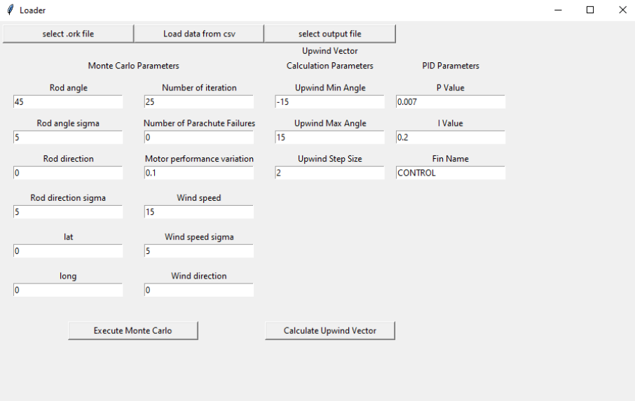

# User Manual

## Monte Carlo

Monte Carlo Simulations can either be run directly from the Command Line or from a GUI. 

### Input Parameters
- Rod Angle: The angle of the rod.
- Rod Angle Sigma: The variation of the rod angle. How much the rod angle can vary across simulations
- Rod Direction: The direction of the rod 
- Rod Direction Sigma: The variation of rod direction. How much the rod direction can vary across simulations.
- Latitude: The Latitude co-ordinate of the launch site.
- Longitude: The Longitude co-ordinate of the launch site.
- Number of Iterations: The number of simulations to run. 
- Number of Parachute Failures: The number of simulations where the parachute will fail. 
- Motor Performance variation: How much the motor performance can vary across simulations
- Wind Speed:  The speed of the wind. 
- Wind Speed Sigma: The variation of the wind speed. How much the wind speed can vary across simulations.
- Wind Direction: The direction of the wind. 

### Command Line
To run the Monte Carlo Simulation from Command Line. Follow the following steps:
1. clone the repository
2. cd group14/lib/openrocketjava
3. ant jar
4. cd ../../
5. pip install -r requirements.txt
6. cd ./src
7. python monte_carlo.py

- Input Parameters can then be passed in by arguments. 
- To find out what arguments found by using the command python monte_carlo.py --help
- The parameters can then passed to the program in the format -argument value

### GUI
To run the Monte Carlo Simulation from GUI. Follow the following steps:
1. clone the repository
2. cd group14/lib/openrocketjava
3. ant jar
4. cd ../../
5. pip install -r requirements.txt
6. cd ./src
7. python gui.py

Footnote: The GUI may show as not responding whilst simulations are running. This is not a bug this is due to the simulations blocking the GUI hence the system may falsely report it as not responding.

- From the GUI, Input Parameters can be entered into the corresponding input field. 
- The output file can be specified by clicking the button at the top of the screen called select output file, and selecting the output file that the user wants
- The rocket model used can be specified by clicking the button at the top of the screen called select .ork file, and selecting the rocket model required. It has to be a .ork file
- Once all the parameters are entered, click the button at the bottom, called Execute Monte Carlo to run the simulations. 

### CSV
- The input parameters can be entered from a CSV file.
- From the GUI, there is a button, to import data from a CSV. 
- Inside the CSV, the input parameters can be in any order and they don't all have to be there.
- The program will import the values from the CSV file and use those in the Monte Carlo Simulations. 

### Output

The program displays out on the console what simulation number the program is currently running.
Once the simulations are finished, results of the simulations are presented:
- Output File
    - The results from all the simulations run are output to a csv file, by default called out.csv
- Output when run from Command Line
    - When run from Command Line, all the results from the simulations are output to the output file
    - The average results from all the simulations are output to the console
- Output when run from GUI
    - When run from Command Line, all the results from the simulations are output to the output file
    - The average results from all the simulations are output to the GUI
    - Maps can then be displayed by clicking on the button to display Maps. 
    

### Maps
 - How to access
   - This page can be accessed via the view map button on the results screen
 - Using the map
   - Upon load there will be 2 kinds of markers (blue and red)
   - Markers
     - The blue marker shows the landing locations of the rocket
     - The red marker shows the locations where the parachute failed to deploy
   - Map tiles
     - The user can zoom in/out by clicking the +/- icons on the top right-hand side of the page    
     - To move around hold the mouse down and drag the mouse
     -  Cache
        -  This software uses a cache this enables tiles to be served faster if they are already cached
        -  Additionally, any precached tiles will enable them to be loaded and the map used without internet access
           -  If the user has no internet and no cached tiles then it will show white
 - First load
   - The first time this page will be loaded the page while be white whilst the map is loaded
   - Once the tiles have been loaded and cached the map for that region will load near instantly
     - This delay is added to respect the open street map rate limits
 - Note
   - Some this feature may not work on some Mac versions
--------------------------
## Upwind Rocket Vectors
* Upwind Rocket Vectors can only be run from GUI. 
* It is run by pressing the 'Calculate Upwind Vector' button in the 'Upwind Vector Calculation Parameters' section. 
* The program will run checks starting at the minimum angle, increasing by step size, until the value exceeds the maximum angle. 
### Input Parameters
* Upwind Rocket Vectors uses most (all parameters except rod angle and rod angle sigma) Monte Carlo Parameters alongside 3 new parameters
* Upwind Minimum Angle: Minimum angle that the upwind rocket vectors will attempt to check
* Upwind Maximum Angle: Maximum angle that the upwind rocket vectors will attempt to check
* Upwind Step Size: Size of steps between each check for upwind rocket vectors.
### Output
* The GUI will display the most optimal angle and its distance. 
* A CSV will be stored to the chosen location
    * The CSV will display each angle that was checked (Angle), and its lateral distance value (Lateral Distance).
--------------------------
## PID

PID has to be run from the GUI. To reach the GUI, follow the same steps as to access the GUI for Monte Carlo. The Input Parameters for PID are on the right-hand side of the GUI in the 'PID Parameters' section. 

### Input Parameters
- P value: This refers to the standard P value for PID.
- I value: This refers to the standard I value for PID. 
- Fin name: The fin name has to be CONTROL for PID to function. 

### Output
- PID doesn't output anything separately from Monte Carlo. By using PID, it is using the PID values in the Monte Carlo Simulations.

--------------------------
