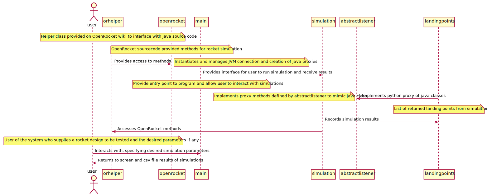
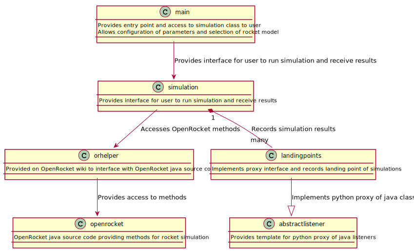
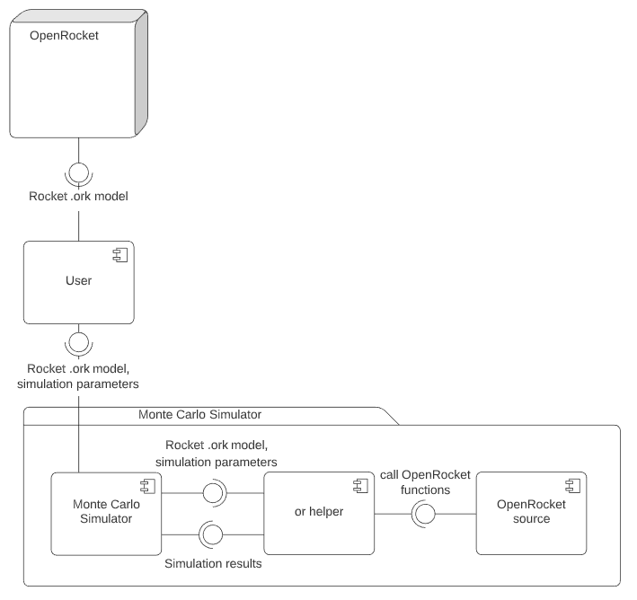
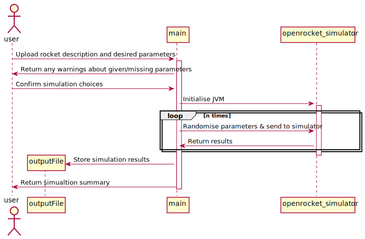

# ENGR 301: Architectural Design and Proof-of-Concept

## Proof-of-Concept

The aim of an architectural proof-of-concept (spike or walking skeleton) is to demonstrate the technical feasibility of your chosen architecture, to mitigate technical and project risks, and to plan and validate your technical and team processes (e.g., build systems, story breakdown, Kanban boards, acceptance testing, deployment).

A walking skeleton is an initial technical attempt that will form the architectural foundation of your product. Since a walking skeleton is expected to be carried into your product, it must be completed to the quality standards expected for your final product. A walking skeleton should demonstrate all the technologies your program will rely on "end-to-end" &mdash; from the user interface down to the hardware.

In the context of ENGR 301, a walking skeleton does not need to deliver any business value to your project: the aim is technical validation and risk mitigation.

## Document

The aim of the architectural design document is to describe the architecture and high-level design of the system your group is to build, to identify any critical technical issues with your design, and to explain how you have addressed the highest rated technical and architectural risks. The architecture document should also demonstrate your understanding of architectural techniques and architectural quality, using tools and associated notations as necessary to communicate the architecture precisely, unambiguously and clearly in a written technical document.

Page specifications below are *limits not targets* and refer to the pages in the PDF generated from the markdown. Because the size of your document is necessarily limited, you should ensure that you focus your efforts on those architectural concerns that are most important to completing a successful system: if sections are at their page limit, indicate how many items would be expected in a complete specification.

The ENGR 301 project architecture design document should be based on the standard ISO/IEC/IEEE 42010:2011(E) _Systems and software engineering &mdash; Architecture description_, plus appropriate sections from ISO/IEC/IEEE 29148:2018(E) _Systems and software engineering &mdash; Life cycle processes &mdash; Requirements engineering_; ISO/IEC/IEEE 15289:2017 _Systems and software engineering &mdash; Content of life-cycle information items (documentation)_; ISO/IEC/IEEE 15288:2015 _Systems and software engineering &mdash; System life-cycle processes_; ISO/IEC/IEEE 12207:2017 _Systems and software engineering &mdash; Software life cycle processes_ and ISO 25010 SQuaRE; with notations from ISO/ISE 19501 (UML). In particular, Annex F of ISO/IEC/IEEE 15288 and Annex F of ISO/IEC/IEEE 12207. These standards are available through the Victoria University Library subscription to the [IEEE Xplore Digital Library](https://ieeexplore.ieee.org/) (e.g., by visiting IEEE Xplore from a computer connected to the University network).

The document should contain the sections listed below, and conform to the formatting rules listed at the end of this brief.

All team members are expected to contribute equally to the document and list their contributions in the last section of the document (please make sure that your continued contribution to this document can be traced in GitLab). You should work on your document in your team's GitLab repository in a directory called "M2_Architecture". If more than one team member has contributed to a particular commit, all those team member IDs should be included in the first line of the git commit message. ``git blame``, ``git diff``, file histories, etc. will be tools used to assess individual contributions, so everyone is encouraged to contribute individually (your contribution should be made to many sections of the document, rather than focusing on just a single section), commit early and commit often.

---

# ENGR 301 Project 14 Architectural Design and Proof-of-Concept

Caitlin Goodger, Luisa Kristen, Zac Durant, Zak Kiernander, Nicole Stallinger and Matthew Butterfield.

## 1. Introduction

One page overall introduction including sections 1.1 and 1.2 (ISO/IEC/IEEE 42010:2011(E) clause 5.2)

Amateur rockets are flown regularly worldwide. These rockets are typically flown with off the shelf rocket motors with widely available propellant reloads. These rockets often exceed the speed of sound, altitudes above 30 km are not unheard of. These rockets are almost never controlled, they are stable due to passive aerodynamic features.

While passively stable rockets are reasonably simple and reliable if well designed, they are susceptible to a variety of disturbances, particularly early in flight. Unexpected winds can cause the rocket to weathercock; flexibility in the launch tower/rail can cause rail-whip, imparting a random launch angle to the rocket; the thrust from the rocket motor is also never perfectly symmetrical.

Amateur rockets are often designed in OpenRocket. OpenRocket gives the ability to simulate rockets while altering some parameter variables as a suggestion for the rocket’s performance. After a rocket has been built, it can be measured accurately to give a more accurate simulation to allow for smaller, finalising adjustments including moving the centre of mass. Automation can allow follow this process to be sped up and determine to a higher confidence of the safety of the flight.

The rocket uses a PID (Proportional Integral Derivative) controller to keep it fixed on an axis. Normally, parameters of PID are difficult to obtain due to the short period of time that the rocket motors are burning. Simulation can allow for estimate parameters for the PID controller.

### Client

Andre Geldenhuis is the client for this project. He has experience with rockets and experience working with similar projects. He can be reached in the Customer Channel on Mattermost. He also has occasionally Q&A sessions during ENGR301 Lectures and can be reached during those times with questions. He can also be reached at andre.geldenhuis@vuw.ac.nz.

### 1.1 Purpose

The purpose of the system to provide a rocket simulation that can help determine, given certain conditions, the rocket's path and where it will likely land. By having a range of conditions, the system will show a range of paths and possible landing points.

### 1.2 Scope

This product is a Rocket Simulation program. 

*  The program shall provide an automation of simulation program OpenRocket to give a prediction of the flight performance of a rocket. 
*  The program shall provide likely landing locations based on varying parameters such as launch angle and parachute ejection time, through a form of Monte Carlo simulation to determine whether the flight is safe. 
*  The program shall provide estimate PID control parameters through the simulation.

### 1.3 Changes to requirements

If the requirement have changed significantly since the requirements document, outline the changes here. Changes must be justified and supported by evidences, i.e., they must be substantiated. (max one page, only if required)

There are currently no changes to the requirements.

## 2. References

References to other documents or standards. Follow the IEEE Citation Reference scheme, available from the [IEEE website](https://ieee-dataport.org/sites/default/files/analysis/27/IEEE%20Citation%20Guidelines.pdf) (PDF; 20 KB). (1 page, longer if required)

[1] “GitHub Wiki TOC generator,” Generate TOC Table of Contents from GitHub Markdown or Wiki Online. [Online]. Available: http://ecotrust-canada.github.io/markdown-toc. [Accessed: 22-May-2020].

[2] “Developer's Guide,” Developer's Guide - OpenRocket wiki, 30-Apr-2020. [Online]. Available: http://wiki.openrocket.info/Developer's_Guide. [Accessed: 08-May-2020].

[3] “Features of OpenRocket,” OpenRocket. [Online]. Available: http://openrocket.info/features.html. [Accessed: 22-May-2020].

[4] “gnu.org,” GNU Operating System. [Online]. Available: https://www.gnu.org/licenses/gpl-howto.html. [Accessed: 22-May-2020].

[5] S. Writer, “Top 10 Software Development Risks,” ITProPortal, 14-Jun-2010. [Online]. Available: https://www.itproportal.com/2010/06/14/top-ten-software-development-risks/. [Accessed: 22-May-2020].

[6] "Sequence Diagram", PlantUML. [Online]. Available: https://plantuml.com/sequence-diagram. [Accessed: 29-May-2020]

## 3. Architecture

Describe your system's architecture according to ISO/IEC/IEEE 42010:2011(E), ISO/IEC/IEEE 12207, ISO/IEC/IEEE 15289 and ISO/IEC/IEEE 15288.

Note in particular the note to clause 5 of 42010:

_"The verb include when used in Clause 5 indicates that either the information is present in the architecture description or reference to that information is provided therein."_

This means that you should refer to information (e.g. risks, requirements, models) in this or other documents rather than repeat information.

### 3.1 Stakeholders

See ISO/IEC/IEEE 42010 clause 5.3 and ISO/IEC/IEEE 12207 clause 6.4.4.3(2).

For most systems this will be about 2 pages, including a table mapping concerns to stakeholder.

#### Stakeholder Requirements

##### Client

##### School of Engineering and Computer Science
* ECS requires that all aspects of the project are correctly licensed. 
* ECS requires all aspects of the project follow the guidelines set out by ECS. 
  
##### Wider Rocket Community
* To improve and extend openRocket. 
  * This includes but is not limited to automating some processes, such as choosing variables, and exporting landing results, having the ability to export these results for future reference.

### 3.2 Architectural Viewpoints
(1 page, 42010 5.4) 

Identify the architectural viewpoints you will use to present your system's architecture. Write one sentence to outline each viewpoint. Show which viewpoint frames which architectural concern.

Logical: The logical viewpoint describes the system functions for the end user. It describes how the user interacts with the system and what classes are involved. It is being represented with class and state diagrams. It also provides information about how the user will move between the classes and states. 

Development: The development viewpoint describes the architecture the support the processes involved in the development cycle to manage the software. It describes the management system of the software to address the concerns regarding the management. 

Process: The process viewpoint describes the dynamic and non-functional requirements. These requirements include concerns around performance and availability concurrency. It also describes how the logical views fits with the process view.  

Physical: The physical viewpoint describes how the software fits with the hardware of the system. It describes the how the software deals with the hardware availability, reliability, performance and scalability of the system. 

Scenarios: The scenarios viewpoint describes the user cases of the system. It describes how the user and the system interact with each other. 

Circuit Architecture: The circuit architecture viewpoint describes how the physical system is put together. Due to the fact that this is entirely a software project this section is not appropriate for this project.

Hardware Architecture: The hardware architecture viewpoint describes how the hardware functions in the system, and allows it to function. Due to the fact that this is entirely a software project this section is not appropriate for this project. 

### 4. Architectural Views

(5 sub-sections of 2 pages each sub-section, per 42010, 5.5, 5.6, with reference to Annex F of both 12207 and 15288) 

Describe your system's architecture in a series of architectural views, each view corresponding to one viewpoint.

You should include views from the following viewpoints (from Kruchten's 4+1 model):

 * Logical
 * Development
 * Process
 * Physical 
 * Scenarios - present scenarios illustrating how two of your most important use cases are supported by your architecture

As appropriate you should include the following viewpoints:

 * Circuit Architecture
 * Hardware Architecture

Each architectural view should include at least one architectural model. If architectural models are shared across views, refer back to the first occurrence of that model in your document, rather than including a separate section for the architectural models.

### 4.1 Logical

The logical view describes the how the system functions for the end user. The diagrams below help to illustrate how the system performs those functions and how the user interacts with the system. The diagram illustrates how the user interacts with each of the classes inside the system. It provides an explanation of how the classes interact with each other so that the user can use the system. 

The user interaction model shows all the classes as well as the user and how they interact.  The user is shown to be on the far left of the diagram as they start off the process. The classes are shown in boxes along to top and bottom on the digram. The classes are at the top and the bottom so that it is easier for the user to read. There are red dotted lines between the two boxes for a class. This makes means that it is clear where each class sits. There are red arrows between classes to show how the classes interact with each other. These arrows are labeled with explanations so that it is clear why the two classes interact with each other. The arrows map out the entire process from the user running the system, to receiving the output at the end. Boxes with further explanations are also on the diagram to add further context as to what is happening.

User interaction model

The class interaction model shows how all the classes interact. Each class is has a box that shows the name of the class as well as a definition of the class and what it provides the user. There are then arrows between the classes show how they interact with each other. There is a definition associated with the arrow, as to why there is a connect between those two classes. 

Class interaction model

### 4.2 Development

Component Model

This diagram shows the relationships of our system with external components, and the necessary interfaces.

### 4.3 Process

The process viewpoint describes the dynamic and non-functional requirements. It shows the process what happens when the user runs the system. It shows all the interacts between classes and the order in which they happened. 

The sequence model diagram is set up in the same way as the user interaction model as the logical view. The user is shown on the left of the diagram and the classes being shown in boxes along the top and bottom. There is also a box for the output file, where the results are put at the end of the process. There are arrows between the classes and the user that shows when they classes and users interact with each other. The arrows include a definition of the arrow and explanation of what happens. This definition helps explain the process and show what happens. There is a box in the middle of the diagram what is labeled loop. This section loops through n times and is in a loop box so that the arrows don't need to be repeated and the diagram is clearer. 

Sequence model

### 4.4 Physical 

This project is entirely a software project. This section describes the how the software deals with the hardware availability, reliability, performance and scalability of the system. Due to the fact that this is entirely a software project these are no concerns that need to be considered. As the software is creating a simulation, it doesn't have deal with hardware availability, reliability, performance and scalability. These are the hardware features that can make it harder to integrate the software with the hardware.  

However, this project is part of a larger system that does have hardware components. For this project to be able to interact with the larger system, there are some hardware concerns. When interacting with projects that have hardware, there may be some concerns around how the software interacts the hardware of those projects. These concerns are the concerns mentioned above. While these aren't concerns for this project, they are concerns when interacting with other project. Since they aren't concerns for this project, there are no architecture views in this section, but they may need to be considered when interacting with other projects.

The simulation function of this project, this will be used by groups building a rocket to simulate how the rocket design will fly, and where it could land. Since the simulation can be run with any rocket model that has been degined in Open Rocket, as long as the the rocket has been modelled in Open Rocket, the simulation can be run. It is not dependent on the hardware used for the rocket as it is just a model.

### 4.5 Scenarios
We have determined our 2 most important scenarios for our MVP are for the user to be able to run multiple simulations and be able to run these simulations on any valid rocket file the user imports. As such our design will utilise the orhelper which will enable the user to import any rocket file and provides a consistent interface to open rocket so regardless of the rocket imported we can be assured it will be handled. Running multiple simulations are then supported by the simulation class which will enable multiple calls for any given rocket with the optional arguments to vary environmental factors and subsequently returning landing point instances as the final result for each call.

## 5.1 Development Schedule

_For each subsection, make clear what (if anything) has changed from the requirements document._ If unchanged, these sections should be copied over from the requirements document, not simply cross-referenced.

Schedules must be justified and supported by evidences; they must be either direct client requirements or direct consequences of client requirements. If the requirements document did not contain justifications or supporting evidences, then both must be provided here.

Identified dates for key project deliverables: 

**Architectural prototype**
The architectural prototype will be complete by 18 June 2020.

**Minimum viable product**
The minimum viable product as defined in part 1.3.2 of the Project Requirement document will be completed by 4 June 2020.

**Further releases**
Further releases will occur up until the final prototype release, scheduled for the 1 October 2020.

**Changes to these dates**
These dates have not been changed from the project requirement document.

### 5.2 Budget and Procurement

#### 5.2.1 Budget

Present a budget for the project (as a table), showing the amount of expenditure the project requires and the date(s) on which it will be incurred. Substantiate each budget item by reference to fulfilment of project goals (one paragraph per item).

Due to the nature of this project it does not have a budget. The project is extending open source software so there is no need for any licenses to be able to use it. There is also no physical hardware for this project, so no physical items need to be purchased.

#### 5.2.2 Procurement

As stated previously, the nature of the project being purely software means that it does not require hardware items which would need to be procured. The only software required is OpenRocket which is open source and available for access at any point. The storage of the code will be on a group gitlab which is supplied by the university.

### 5.3 Risks 

Identify the ten most important project risks: their type, likelihood, impact, and mitigation strategies (3 pages).

|                          Risks                          | Risk Type | Likelihood | Impact | Mitigation Strategies                                                                          |
| :-----------------------------------------------------: | --------- | ---------- | ------ | ---------------------------------------------------------------------------------------------- |
|Program functioning unexpectedly on different devices          | Technical     | 2          | 3      | Test on multiple different devices.                                                                                                                                                                                                         |
|Adding team members that do not work well with the team        | Teamwork      | 1          | 2      | Have a team contract which all members agree to at time of joining the group.                                                                                                                                                               |
|Losing team member temporarily or permanently at crucial times | Teamwork      | 1          | 3      | Communicate and document issues, progress and plans to the git.                                                                                                                                                                             |
|Team members burning out                                       | Teamwork      | 3          | 3      | Members communicate when they are having issues. Members have regular breaks during lab times.                                                                                                                                              |
|Loss of access to files                                        | Technical     | 1          | 4      | Assure that all files are on the git and on team members devices.                                                                                                                                                                           |
|Not meeting deadlines by underestimating time required         | Technical     | 3          | 2      | Have regular meetings to manage milestones and divide tasks into smaller sections.                                                                                                                                                          |
|Unresolved conflicts between team members                      | Teamwork      | 2          | 3      | Have a team contract with paths to bringing up issues to the rest of the group.                                                                                                                                                             |
|Changes to project requirements                                | Requirements  | 3          | 4      | Create code that is easily adjustable. Only allow minor adjustments (or changes with good reasoning) to the project later.                                                                                                                  |
|Issues with integration of software                             | Technical     | 3          | 4      | Edit software to better flow between sections. Understand software used and the outputs given. Disable features that might be causing issues. Look at possibly using a different version of software for stability and ease of integration. |
|Bugs within the code go undetected                             | Technical     | 3          | 4      | Have test cases with high coverage over the program. Check tests frequently throughout development to assure that new issues have not occurred. Have multiple people working on and checking the same code to avoid logic errors.           |

### 5.4 Health and Safety

The project does not involve any external work or testing at any other workplaces or sites. This limits H&S concerns to those present in the team members development environment.
Due to COVID-19 response no work is taking place in the Victoria University labs and thus all H&S risks such as cable management, occupational strain and workspace ergonomics are the responsibility of the team member.
Regular breaks will be taken in the prearranged lab slots to ensure members have a chance to stretch and avoid strain. No ethical considerations need to be made around any animal or human subjects due to the nature of the project.

#### 5.4.1 Safety Plans

Project requirements do not involve risk of death, serious harm, harm or injury. The nature of the project as a pure software development exercise limits the safety concerns involved.
Due to the COVID-19 pandemic response safety concerns around the observation of social distancing and quarantine procedure were raised and have been addressed by ensuring all team meetings and work sessions are conducted remotely.

## 6. Appendices

### 6.1 Assumptions and dependencies 

- It is assumed that the user has access to a computer, which is able to run openRocket. 
- It is assumed that the members of the model rocket community, and other users, are familiar with openRocket.
- It is assumed that the user will already have a model rocket to load into openRocket.
- It is assumed that for use of the minimum viable product, the user is able to operate Command Line / Terminal, as this does not include the use of a GUI. 
- It is assumed that the inputs entered by the user are of the correct type in order to successfully run the simulations. 

### 6.2 Acronyms and abbreviations

H&S - Health and Safety

ECS - School of Engineering and Computer Science.

## 7. Contributions

| Name | Sections Contributed|
| ---- | ----               |
|Luisa Kristen| 1, 1.1, 1.2, 3.1, 5.1, 5.2.1, 5.4, 5.4.1, Spelling & Grammar |
|Zac Durant   | 4.1, 4.3             |
|Zak Kiernander | 4.5          |
|Nicole Stallinger| 4.2        |
|Caitlin Goodger|1,1.1,3.2,4.4,5.2.1           |
|Matthew Butterfield| 5.1, 5.2.2, 5.3, 6.1, 6.2 |

---

## Formatting Rules 

 * Write your document using [Markdown](https://gitlab.ecs.vuw.ac.nz/help/user/markdown#gitlab-flavored-markdown-gfm) in your team's GitLab repository.
 * Major sections should be separated by a horizontal rule.

## Assessment 

This document will be weighted at 20% on the architectural proof-of-concept(s), and 80% on the architecture design.

The proof-of-concept will be assessed for coverage (does it demonstrate all the technologies needed to build your project?) and quality (with an emphasis on simplicity, modularity, and modifiability).

The document will be assessed by considering both presentation and content. Group and individual group members will be assessed by identical criteria, the group mark for the finished PDF and the individual mark on the contributions visible through `git blame`, `git diff`, file histories, etc. 

The presentation will be based on how easy it is to read, correct spelling, grammar, punctuation, clear diagrams, and so on.

The content will be assessed according to its clarity, consistency, relevance, critical engagement and a demonstrated understanding of the material in the course. We look for evidence these traits are represented and assess the level of performance against these traits. Inspection of the GitLab Group is the essential form of assessing this document. While being comprehensive and easy to understand, this document must be reasonably concise too. You will be affected negatively by writing a report with too many pages (far more than what has been suggested for each section above).

---
