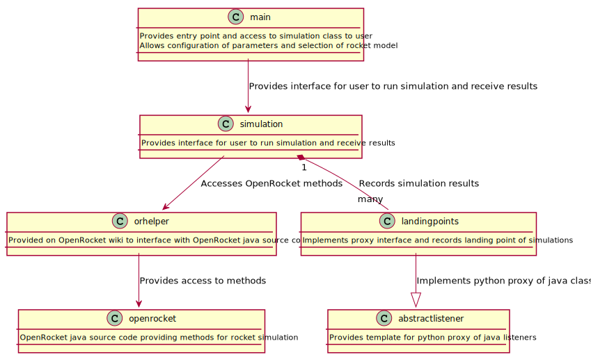

# ENGR 301 Project 14 Project Proposal and Requirements Document
Caitlin Goodger, Luisa Kristen, Zac Durant, Zak Kiernander, Nicole Stallinger and Matthew Butterfield. 

---

## 0. Table of Contents

- [ENGR 301 Project 14 Project Proposal and Requirements Document](#engr-301-project-14-project-proposal-and-requirements-document)
  * [1. Introduction](#1-introduction)
    + [Client](#client)
    + [1.1 Purpose](#11-purpose)
    + [1.2 Scope](#12-scope)
    + [1.3 Product overview](#13-product-overview)
  * [2. References](#2-references)
  * [3. Specific requirements](#3-specific-requirements)
    + [3.1 External interfaces](#31-external-interfaces)
    + [3.2 Functions](#32-functions)
    + [3.3 Usability Requirements](#33-usability-requirements)
    + [3.4 Performance requirements](#34-performance-requirements)
    + [3.5 Logical database requirements](#35-logical-database-requirements)
    + [3.6 Design constraints](#36-design-constraints)
    + [3.7 Nonfunctional system attributes](#37-nonfunctional-system-attributes)
    + [3.8 Physical and Environmental Requirements](#38-physical-and-environmental-requirements)
    + [3.9 Supporting information](#39-supporting-information)
  * [4. Verification](#4-verification)
    + [4.1 External Interfaces](#41-external-interfaces)
    + [4.2 Functions](#42-functions)
    + [4.3 Usability](#43-usability)
    + [4.4 Performance](#44-performance)
    + [4.5 Logical Database](#45-logical-database)
    + [4.6 Design Constraints](#46-design-constraints)
    + [4.7 Nonfunctional Attributes](#47-nonfunctional-attributes)
    + [4.8 Physical and Environmental](#48-physical-and-environmental)
  * [5. Development schedule.](#5-development-schedule)
    + [5.1 Schedule](#51-schedule)
    + [5.2 Budget](#52-budget)
    + [5.3 Risks](#53-risks)
    + [5.4 Health and Safety](#54-health-and-safety)
      - [5.4.1 Safety Plans](#541-safety-plans)
  * [6. Appendices](#6-appendices)
    + [6.1 Assumptions and dependencies](#61-assumptions-and-dependencies)
    + [6.2 Acronyms and abbreviations](#62-acronyms-and-abbreviations)
  * [7. Contributions](#7-contributions)

---

## 1. Introduction

Amateur rockets are flown regularly worldwide. These rockets are typically flown with off the shelf rocket motors with widely available propellant reloads. These rockets often exceed the speed of sound, altitudes above 30 km are not unheard of. These rockets are almost never controlled, they are stable due to passive aerodynamic features. 

While passively stable rockets are reasonably simple and reliable if well designed, they are susceptible to a variety of disturbances, particularly early in flight. Unexpected winds can cause the rocket to weathercock; flexibility in the launch tower/rail can cause rail-whip, imparting a random launch angle to the rocket; the thrust from the rocket motor is also never perfectly symmetrical.

Amateur rockets are often designed in OpenRocket. OpenRocket gives the ability to simulate rockets while altering some parameter variables as a suggestion for the rocket’s performance. After a rocket has been built, it can be measured accurately to give a more accurate simulation to allow for smaller, finalising adjustments including moving the centre of mass. Automation can allow follow this process to be sped up and determine to a higher confidence of the safety of the flight.

The rocket uses a PID (Proportional Integral Derivative) controller to keep it fixed on an axis. Normally, parameters of PID are difficult to obtain due to the short period of time that the rocket motors are burning. Simulation can allow for estimate parameters for the PID controller.

### Client

Andre Geldenhuis is the client for this project. He has experience with rockets and experience working with similar projects. He can be reached in the Customer Channel on Mattermost. He also has occasionally Q&A sessions during ENGR301 Lectures and can be reached during those times with questions. He can also be reached at andre.geldenhuis@vuw.ac.nz. 

### 1.1 Purpose

The purpose of the system to provide a rocket simulation that can help determine, given certain conditions, the rocket's path and where it will likely land. By having a range of conditions, the system will show a range of paths and possible landing points.

### 1.2 Scope

This product is a Rocket Simulation program. The program shall provide an automation of simulation program OpenRocket to give a prediction of the flight performance of a rocket [2]. The program shall provide likely landing locations based on varying parameters such as launch angle and parachute ejection time, through a form of Monte Carlo simulation to determine whether the flight is safe. The program shall provide estimate PID control parameters through the simulation.

### 1.3 Product overview 

The following subsections describe the product perspective, functions, characteristics and limitations.

#### 1.3.1 Product perspective

The project is extending existing software. OpenRocket is an existing open-source project that allows users to design and simulate rocket models before creating the building them. This project is extending the simulation capabilities to allow for multiple simulations to be run at once. OpenRocket only allows for one simulation, with one set of conditions and parameters, so this project is extending this functionality to have multiple simulations and multiple conditions and parameters. Since this project is extending existing software it needs to be able to interact with OpenRocket and have similar looking interfaces for ease of use. The user will need to create the model for their rocket in OpenRocket. The project will then use that rocket to run the simulation. This means that it needs to be able to export the data from OpenRocket and be able to use it in the simulation. 

The user interface should be simple and clear. As the user is likely coming from or has experience with using OpenRocket, they will want this project to function in similar ways. Due to the fact that it is an extension of OpenRocket, this is important because it is building on their base. The user interfaces for this project don't need to be extremely complicated because most of the interfaces that the project is added are for the user to select parameters and then get the output of the simulation. For the minimal product, this output could be written to a file. This would be easy for the user to understand as long as it is laid out in a sensible fashion. For an extension, a graphical interface could be added so that the output of the simulation is clear for the user to understand. 

This project is also part of a large project. There is another project focused on building a rocket and another project focused on Mission Control. This project will be the go-between of the hardware and the software components. This means that the project needs to be interact with the other two projects and communicate with them. The project building a rocket needs to be able to use the simulation to know how the rocket they have designed will travel and where it could land. The Mission Control project also needs to use the simulation for functionality such as knowing if the current weather conditions are safe to launch in. Mission Control will be using this project while at the rocket launch site which will likely not have an internet connection. This means that the project needs to be able to function without requiring an internet connection as well. 

#### 1.3.2 Product functions

To meet the requirements of the minimum viable product the project will;

- Be able to import a rocket file designed in OpenRocket.

The program must be able to correctly load and work with OpenRocket `.ork` files defining the features of different rockets. This allows the customer to create simulations for a wide variety of different rocket configurations and enables the use of the already familiar OpenRocket design system.

- Take a given latitude and longitude point for launch.

The program will need to correctly maintain and use a coordinate system to provide meaningful data from the simulation. This data could come in the form of simple projected latitude and longitude, distance-bearing predictions or scatter plots of possible landing zones.

- Run multiple simulations with the given rocket and co-ordinates and produce possible landing points.

The program must be able to create meaningful statistical variations to produce varying flights in the simulations. This is crucial to show the use a variety of possible landing sites should the environment change, minimising the chance of a dangerous launch.

- Output results to both the screen and to a file.

The program should output meaningful results to the screen for quick viewing at mission control, allowing the user to quickly determine if the launch is safe. Outputting the results to a file would add functionality, allowing the user to use the tool as a method of evaluating rocket designs in various conditions.

#### 1.3.3 User characteristics   

1. Rocket Hobbyist

The main class of users is the rocket hobbyist engaged in designing and flying their own rockets. The program is designed specifically for these users to simulate their rockets and predict landing zones and the severity of environmental variations.
Several characteristics are assumed about the user;

- Familiarity of rocket components and design

We assume some knowledge of rocket components and design. This is necessary as the data will be presented in a manner that might not be entirely accessible to a user with no rocket hardware knowledge.

- Experience with OpenRocket

We rely on the user having experience with OpenRocket, especially the process of designed and exporting custom rockets.

- Technologically literate

We expect some level of familiarity with computer systems and using applications. Design of user interface will assume the user is comfortable with navigating typical interfaces.

- Understanding of coordinate system

Some understanding of latitude and longitude coordinates will be required to make full use of the program output. In the initial program the presentation of the data may require some evaluation by the user to determine if the launch is safe. Extensions to the program would reduce the importance of this assumption.

#### 1.3.4 Limitations

- PID Control

Inclusion of PID control will be limited in the initial development of the program by the lack of native support in OpenRocket's python scripting implementation. This functionality may be developed at a later date. 

-  Safety Considerations

The results of the simulations will be need to be given safety margins, reducing the possible precision. Variation of parameters such as wind will need to be slightly overestimated to ensure the program gives a worst case prediction.

-  Internet access

Under the assumption that the system must perform without access to the internet some functions might be impeded, particularly proposed extensions to the program such as google maps overlay and current weather data integration.

- Physical conditions

Some limitation will need to be placed on the range of environments the program is suitable to simulate. Outside of certain reasonable parameters the environment will likely be too extreme and unpredictable to remain reliable. Examples include extreme wind, rain or unreliable rocket designs.

- Reliability

Below the minimum required number of simulations the program output will not be reliable and should not be used to accurately predict the safety of a launch. In this configuration the program should warn the user and may not output all the usual predictions.

---

## 2. References

[1] “GitHub Wiki TOC generator,” Generate TOC Table of Contents from GitHub Markdown or Wiki Online. [Online]. Available: http://ecotrust-canada.github.io/markdown-toc. [Accessed: 22-May-2020].

[2] “Developer's Guide,” Developer's Guide - OpenRocket wiki, 30-Apr-2020. [Online]. Available: http://wiki.openrocket.info/Developer's_Guide. [Accessed: 08-May-2020].

[3] Civil Aviation Authority of New Zealand, Civil Aviation Rules Part 101 Gyrogliders and Parasails, Unmanned Aircraft (including Balloons), Kites and Rockets - Operating Rules, 31 December 2018. [Online]. Available: https://www.aviation.govt.nz/assets/rules/consolidations/Part_101_Consolidation.pdf. [Accessed: 22-May-2020].

[4] “Features of OpenRocket,” OpenRocket. [Online]. Available: http://openrocket.info/features.html. [Accessed: 22-May-2020].

[5] “gnu.org,” GNU Operating System. [Online]. Available: https://www.gnu.org/licenses/gpl-howto.html. [Accessed: 22-May-2020].

[6] S. Writer, “Top 10 Software Development Risks,” ITProPortal, 14-Jun-2010. [Online]. Available: https://www.itproportal.com/2010/06/14/top-ten-software-development-risks/. [Accessed: 22-May-2020].

## 3. Specific requirements  

This section describes the external interfaces, functions, usability requirements, performance requirements, logical database requirements, design constraints, non-functional system attributes, physical and environmental requirements and any supporting information.

### 3.1 External interfaces

* Rocket Model Input
    * Allows the user to specify a `.ork` file when running the program. This `.ork` file will describe the rocket to be modelled (Motor config, aerodynamics, weight etc)
    * This file should be generated in the OpenRocket application by designing the desired rocket and exporting the OpenRocket rocket description to a file
    * This file should be parsed to the system by a parameter or selected in a GUI
    * This file must be a valid OpenRocket description from a compatible version of OpenRocket

* Environmental Variables
    * Allows the user to specify environmental parameters such as wind speed, launch angle and launch position when launching the program
    * These inputs should be optional, allowing the user to run simulations with the default launch conditions and with some meaningful statistical variation
    * These inputs should be within OpenRocket's tolerance for the given input type
    * These inputs should all be in SI units

* Screen Output
    * Allows the user to view a summary of simulation results in the window from which they launched the simulation
    * This output should be limited to summary statistics to reduce clutter and ensure the output is readable and useful
    * All outputs should be in SI units

* CSV Output
    * Allows the user to view full simulation results in the spreadsheet viewer of their choice
    * These outputs should be stored in a valid csv format viewable by most common spreadsheet programs and should format the data such that it can be easily understood and operated on
    * Various simulation statistics should be stored from each of the individual flights along with summary statistics

* Weather Data
    * Allows the user to run simulations with current weather data fetched from a weather API
    * These inputs will require an internet connection and should be disabled when a connection cannot be made - this should alert the user that manual weather data must be set

* PID Control
    * The possibility of interfacing with a PID controller designed externally is a target of the system, allowing the user to simulate the performance of their rocket under a given PID configuration
    * The input format of this interface is currently unspecified, as is the method of connecting this interface.

### 3.2 Functions

Steps marked with asterisks are sub-cases.

#### Run Multiple Simulations Automatically (Minimum Viable Product)

| User Intention                           | System Requirements                       |
| ---------------------------------------- | ----------------------------------------- |
| *Import rocket (Minimum Viable Product)* |                                           |
| *Edit Simulation Location*               |                                           |
| Click "Run Simulations"                  |                                           |
|                                          | *Automated parameter varying*             |
|                                          | Run multiple simulations                  |
|                                          | *Return results (Minimum Viable Product)* |

This use case shows the minimum viable product of this project. This does not 
contain any extensions or features allowing the customisation of the 
simulations. This use case is the most important as it represents the minimum
level of functionality that would make a viable product. This is run through the command line and does not include any graphical user interface extensions.

#### Import a Rocket (Minimum Viable Product)

| User Intention                          | System Requirements                             |
| --------------------------------------- | ----------------------------------------------- |
| Input rocket file location with CL flag |                                                 |
|                                         | Parse file \(Display error if relevant\)        |
|                                         | Display base information for rocket from import |

This use case allows users to import a customised rocket from OpenRocket into
our project. This use case is contained within the minimum viable product. It
is essential that users are able to import their own rockets so that the
results of the simulations are applicable to a user's situation, and therefore useful.

#### Edit Simulation Location

| User Intention | System Requirements                  |
| -------------- | ------------------------------------ |
|                | Prompt for lat and long co-ordinates |
| Input values   |                                      |
|                | Record changes                       |

This use case allows users to input custom latitude and longitude co-ordinates through the command line.

#### Automated parameter varying

| User Intention | System Requirements                                                                     |
| -------------- | --------------------------------------------------------------------------------------- |
|                | Take initial given values of parachute ejection time, launch angle or motor performance |
|                | Create a collection of random inputs for each value type                                |
|                | Run individual simulations, using the new inputs                                        |

This automated parameter varying forms the basis of the Monte Carlo simulations. 
Currently, users manually vary these values and run simulations. This use case 
is a part of the minimum viable product and important since it is what allows
the user to get results from the Monte Carlo technique.

#### Return Results (Minimum Viable Product)

| User Intention | System Requirements                                     |
| -------------- | ------------------------------------------------------- |
|                | Produce CSV file with the aggregated simulation results |
|                | Export and open results file                            |

This is the returnable results of the minimum viable product. This does not include a scatter plot graph. The results are automatically exported and opened for the user.

#### Run Multiple Simulations Automatically (Extended)

| User Intention               | System Requirements           |
| ---------------------------- | ----------------------------- |
| *Import rocket (Extended)*   |                               |
| *Edit Simulation Automation* |                               |
| Click "Run Simulations"      |                               |
|                              | *Automated parameter varying* |
|                              | Run multiple simulations      |
|                              | *Return results (extended)*   |

This is an extended workflow that we hope to achieve by the end of trimester. This can be extended more so with the listed features in the "Further Extensions" section. The main benefit of this workflow is it running with a GUI, instead of through the command line interface.

#### Running simulation with MVP
| User Intention                                                | System Requirements        |
| ------------------------------------------------------------- | -------------------------- |
| User sets \-o for csv output and \-rocket for the rocket file |                            |
|                                                               | Find/Import rocket         |
|                                                               | Run simulation             |
|                                                               | Export file                |
|                                                               | \(Show error if relevant\) |

#### Import a Rocket (Extended)

| User Intention                | System Requirements                             |
| ----------------------------- | ----------------------------------------------- |
| Select "Import rocket"        |                                                 |
|                               | Prompt file selector                            |
| Navigate and open rocket file |                                                 |
|                               | Parse file \(Display error if relevant\)        |
|                               | Display base information for rocket from import |

This extended use case includes a file selector and is prompted by users selecting "Import Rocket".

#### Edit Simulation Automation 

| User Intention                      | System Requirements                                |
| ----------------------------------- | -------------------------------------------------- |
| Select "Edit Simulation Automation" |                                                    |
|                                     | Display "Edit Simulation Automation" pop up window |
| Edit "Amount of Simulations"        |                                                    |
| Set Longitude,Latitude              |                                                    |
| Select "Save"                       |                                                    |
|                                     | Record changes                                     |

This use case demonstrates how a user would interact with the multiple 
simulation settings. The pop up window will match the style of other OpenRocket setting windows.

#### Return Results (Extended)

| User Intention | System Requirements                                     |
| -------------- | ------------------------------------------------------- |
|                | Produce CSV file with the aggregated simulation results |
|                | *Produce Scatter Plot*                                  |
|                | Display results to user with export options.            |

The extended workflow of returning results includes a scatter plot graph of possible landing locations and a GUI display of results found.

#### Produce Scatter Plot

| User Intention   | System Requirements   |
| ---------------- | --------------------- |
| Import rocket    |                       |
| Select View plot |                       |
|                  | Run Simulations       |
|                  | Generate plots        |
|                  | Draw plots onto a map |
|                  | Display map to user   |

This is the workflow of producing the scatter plot. This is an extension to the minimum viable product. 

#### Further Extensions:

- Define an upward vector for the rocket to follow

This would allow the user to specify the wind direction and minimise the distance travelled.
- Overlaying over google maps

This would allow the user to view the possible landing sites overlaid on a google maps representation of the launch site, reducing guess work and providing more clarity on landing safety.

- Fix computational listeners in OpenRocket

Fixing the implementation of computational listeners would allow the program to make changes to the environment model mid-flight simulating for example varying wind speeds at different altitudes

- Motor gimbaling

Implementation of motor gimbaling could be used to simulate the path of a rocket using a controller to adjust its direction.

- PID Controller simulation

Use the simulations to determine estimations for the PID control parameters.

- Current weather integration

Whether APIs could be used to fetch current environmental variables for simulation.

### 3.3 Usability Requirements

Goal: 

The purpose of the system to provide a rocket simulation that can help determine, given certain conditions, the rocket's path and where it will likely land. By having a range of conditions, the system will show a range of paths and possible landing points. Since this system will be extending OpenRocket, it is important that it is easy for the user to move between systems. It is also important that it is open to the wider avionics community, so it will be made open source so that others can learn and build from it. 

Purpose and Objective: 

For this system to be effective, the product needs to meet the minimum viable product. This means that the system needs to be able to import a rocket from OpenRocket and then run multiple simulations with a variety of parameters. To measure how effective the system is, it can be tested with a range of Rocket types from OpenRocket to ensure that it can be effective with a range of rocket types. It is hard to measure the effectiveness, so the best idea is to test it with a range to make sure that it will work effectively for the user. 

For the system to be efficient, the system needs to be able to complete the minimum viable product and any extensions in a reasonable time. This means that the user will be able to get the output within a reasonable time. This is also very hard to measure but the best way is to test it repetitively with a range of inputs so that the system will be able to function for all the user's needs. For it is be efficient for the user to use, the output must also be easy to understand. The minimum viable product has the output being placed in a csv file. This means that it is organised into columns and makes it easy for the user to read. This makes this efficient for the user to use because they don't have to take time trying to decipher the output.

To satisfy the users of this system, the system needs to be able to complete the minimum viable product, because then it can complete the main objectives of the system. If it is meets the minimum viable product, then the system can run multiple simulations with a range of parameters. If the system has extended the minimum viable product, then it will aim to make it easier for the user, therefore satisfying them more. Therefore, the satisfaction criteria for this system, is meeting the minimum viable product, and if possible extending the system to make it easier to use. 

### 3.4 Performance requirements

Performance requirements define the expected performance of our software, outlining what the user's base expectation can be from using our product. 

- The software should provide a list of required/available parameters to the user to assist in usability, this will be achieved by creating and enabling parameter flags that the program can be run with. 

- The program should support the simulation of all valid rocket models produced in OpenRocket 1.9 (`.ork` files), this will be achieved by maintaining the current OpenRocket functionality. 

- The program should support the use of a single user simulating the performance of a single modelled rocket. The user should be able to execute the program more than once simultaneously to exceed this limit. This will be achieved by ensuring the program can be opened and run multiple times, in seperate windows. 

- The user should be able to provide additional information to the program to be used for the simulations such as launch-site and environmental conditions, we will achieve this by providing clear and easy to fill in GUI input options.

- The number of supported simulations that can be run and summarised in a single execution should be guaranteed < 1000, this will be achieved by validating the number of simulations specified. 

- Average time taken per simulation should not exceed 0.5 seconds, which we will achieve by optimising our code to run quickly. 

- The time taken to perform the simulation should scale linearly with the number of individual simulations run, this will be achieved by running each simulation independently.

- Resulting data should be output to the screen in a readable manner making use of summary functions and the full dataset should be output to a csv file.

- The program should use a sensible method of statistical variation to provided a meaningful exploration of possible launch scenarios. This will be achieved by maintaining the current method of statistical variation provided in OpenRocket. 

### 3.5 Logical database requirements

### 3.6 Design constraints

The design constraints define the software and hardware requirements placed on the system by external standards, regulatory requirements, project limitations, existing standards and regulations. It also includes constraints placed on the system by client requirements and government requirements. Since there are no hardware components to this system, there are no constraints on hardware. Since this system is software there are software constraints placed on the system.

One of the client requirements of this project is that the project is made open source. This, therefore, constrains the system to use open source resources. The largest external resource of this system is OpenRocket, which is an open source system. This means that it meets this requirement. Once, this project is completed, the source code needs to be packaged according to open source requirements. This is an important requirement that this project requires. 

There are many constraints and regulations for launching rockets. Rockets have to be in accordance with the New Zealand Civil Aviation Authority [3]. As mentioned above, this project has no hardware, and no constraints, as it is simulating rockets. However, given that this project is centred around rockets, they are constraints and regulations to be aware of. These regulations stipulate the maximum size of the rocket, as well as what it can and can not be made of. These are not regulations or constraints that affect this project but will affect the larger project that this system is a part of. One of the other projects, will be using this project to simulate how their rocket will fly. These regulations will constraint them, so it is something to be aware of. 

Due to the fact that this system is extending from existing software, that leads to constraints on the system. This system has to be able to integrate with OpenRocket to be able to function correctly. One of the constraints placed on this system, is the input that it should be able to receive. Since this project is an extension of OpenRocket, it means that it should take a rocket designed in OpenRocket as input. This constrains the system as it has to be able to function with input from OpenRocket. 

The report format for the minimum viable product, is an csv file. This is due to the fact it is an easy and simple format for the user to be able to read and understand. The report format should be understandable for the user, which is why the file choice was made. The output of the simulation is the main reporting function of the system. There are no other constraints on the report format. 

Due to the fact that the system is extending OpenRocket, there are some limitations around data naming. As there is a rocket being imported from OpenRocket, the data naming should be consistent with OpenRocket, to ensure that it is consistent for the user. The data naming should also be consistent across files, and inside files, to ensure consistency and ease of use. The user can also add parameters to the simulation, such as wind speed, as arguments and it is important that it is clear that these arguments have clear name. This can be helped by offering a help menu, clearly describing each argument option. This can also be mitigated by having clear data naming so it is clear to the user. 

There are no constraints relating to accounting procedures or audit tracing. This is due to the fact there is no budget and no monetary transactions in the system. This means that there are no accounting procedures that need to be followed. This means that there is also no need for audit tracing to be considered. Therefore, there are no constraints placed on the design by external standards or regulatory requirements. 

### 3.7 Nonfunctional system attributes

#### Open Source

This is an open source project, as is OpenRocket. This will be released under the GNU GPL v3 license, as to avoid any issues that would result from a conflicting license to OpenRocket [4][5]. 

#### Usable

This system must be usable by our target users, which are rocket hobbyist. The system needs to be designed so that users can efficiently utilise its key functions. High usability can be achieved by focusing on user needs during the system design, asking users for feedback throughout development, and assessing user experience with prototypes or the finished build.

Usability can be assessed from user satisfaction. Good usability is seen when users are positive about their experience of using our demos and prototypes. It can also be assessed when observing user experience. A new user having issues with the interface being unintuitive, or inefficient, are indicators of poor usability. 

#### Extensible

This system will be designed to be highly receptive to future extensions. New functionality should be easy to integrate with the base system and not interfere with the base system. This will be worked towards with maintaining code modularity. Modularity will ensure that features can be easily plugged in, and the existing modules will be self contained.

#### Fault Tolerant

This system will be designed in anticipation of errors and exceptional inputs. A fault tolerant system would take these inputs and errors will not result in system failure, and return the user to an error free state. 

This attribute can be assessed with the development of test cases. 

#### Documented

This system will maintain up to date and usable documentation for developers and users. Our documentation will be include, but not be limited to, detailed comments, architecture diagrams, project requirement specifications, and a succinct user readme. 

A well documented system for developers can be observed through the ease of collaboration. Work that is poorly documented will be harder for a new worker to independently pick up. Poor documentation for users can be seen when the learning curve to understand the system is higher than reasonable.

#### Integrated

It is crucial that this system is well integrated with OpenRocket. Integration is done mostly through the Orhelper class, which has been provided to interface with OpenRocket. 

#### Portable

Portability outlines how usable a system is in different operating environments. This attribute can be achieved by packaging the project. This ensures that the project is more portable, and easily able to be used across different devices. Portability will be tested by ensuring packaged software is useable on a variety of hardware and operating systems.

### 3.8 Physical and Environmental Requirements 

Due to the nature of the project being purely software does not have many physical or environmental requirements. The only requirement that the project has, is to have a computer to run the program on. This computer has to have JPype installed, and be running at least Python version 3.0, but Python 3.7 onwards is recommended.

#### Client Requirements

#### Faculty of Engineering and Computer Science
The faculty requires that all aspects of the project are properly licensed. 

The faculty requires that all aspects of the project follow the guidelines set out by ECS.

##### Critical success factor
It is critical to the success of the project and to the faculty that all guidelines set out by them are followed. This includes but is not limited to the project student agreement.

#### Wider Rocket Community

To improve and extend OpenRocket. This includes but is not limited to automating some processes, such as choosing variables, and exporting landing results, having the ability to export these results for future reference. 

##### Critical success factor
In order to be useful for the wider rocket community, it is vital that the software is open-source. This allows the community to use and edit our software under the open source license. If the project is not open source, the benefit to the rocket community would be greatly reduced. 

### 3.9 Supporting information

The extension of OpenRocket will add both to the ease of use and body of knowledge within the model rocket community. This project aims to simulate the flight of model rockets, in a wide range of conditions, in order to predict the landing site of these rockets. This will increase the ability to predict these during rocket launches. By being able to run multiple simulations at once, it will not only allow for a faster simulation experience, but also be have these results easily available for future reference, due to the outputting of these to a CSV file.

As this is an open source project, the final software will be freely available for anyone to view and edit. This adds to the longevity of the project, as it can be improved by the community in the future. 

---

## 4. Verification

This section describes the verification of this project in regards to external interfaces, functions, usability, performance, logical database, design constraints, not-functional system attributes and physical and environmental requirements.

### 4.1 External Interfaces

Verification of external interfaces will include CI testing of invalid states and inputs from external entities in addition to runtime input verification to ensure external interactions are valid. Many invalid external interactions can occur:

- Invalid rocket uploaded to system : System will accept only `.ork` files and catch any errors thrown when parsing the file, reporting any issues to the user.

- Invalid environment variables : System will only accept inputs of the correct format and will warn the user when parameters are outside of normal bounds.

- Failed API call : System should detect and deal with failed API calls smoothly, alerting the user to unavailability of the requested data.

- Failure to write to file : System should alert the user that the file write has failed and request another file path be used.

### 4.2 Functions

Verifying the desired system functions are reliable and complete will be done through a combination of CI tests and manual testing. By manually acting out each use case specified in 3.2, the user experience can be tested and any issues with usability or program execution can be found. CI tests will be used to automate some of these use case tests to ensure none of this required functionality experiences a regression.

For each function described in 3.2 the use case will be tested and any undesired behaviour logged as an issue. Automated tests will also be written to test a variety of inputs including edge cases and invalid invocations.

### 4.3 Usability

Verification of the usability criteria will consist of ensuring the product meets the minimum viable product specification as well as ensuring reliable effectiveness and efficiency.

- MVP Spec : Adherence to the MVP specification will be assured by the verification of other sections of the program including functions, performance and system attributes. Provided these verifications pass we can be confident that the minimum viable product will meet usability criteria for the client.

- Effectiveness : Verification of effectiveness will entail testing the program with a variety of different parameters, inputs and desired outputs to ensure the system produces reliable and consistent results. CI testing allows the use of wide test spaces to ensure the system operates correctly within the supported parameters and that it will provided effective estimates to the user.

- Efficiency : Verification of efficiency will consist of performance intensive stress tests of the system, ensuring the time and resources taken to compute the simulations is within useable range for the client. Simulations should not take more than 0.5 seconds each, allowing the user to perform a large number of simulations at once. CI tests will allow simulation executions to be timed and the performance change between development builds to be monitored.

### 4.4 Performance

Testing performance can be achieved easily using CI, allowing large test sets to be run automatically. 
Running large numbers of simulations will allow us to guarantee our target specification of 1000 simulations and 0.5 seconds per simulation being supported. Performance tests will also involve ensuring that the statistical variation being used results in meaningful variation in the simulation results that give useful predictions on rocket performance.
 
### 4.5 Logical Database

Verification of the logical system design is a manual process, ensuring the implementation does not significantly deviate from the current UML description. This UML description can and will change as the project is developed. Verification will need to be made one new merges that the updated program still conforms to the UML or whether the UML diagram needs to be updated.

### 4.6 Design Constraints 

Design constraint requirements need to be verified by ensuring that all contraints enforced by external standards, regulations, client requirements and license requirements.

- OpenRocket Integration : The product will be developed in a manner that ensures the compatibility with OpenRocket. Due to the nature of the project, any change that would violate this constraint would render the product unusable and therefore specific testing of this requirement is not needed.

- Open Source : The product is required to be made open source. Any addition to the program will need to be considered in this area to validate that libraries / packages used are permitted to be used open source and that all of our requirements are met under our OpenRocket open source obligations.

### 4.7 Nonfunctional Attributes

- Open Source : As above in 4.6 consideration will be made with each addition to the program that open source obligations are met.

- Usability : Measures of usability are discussed in 4.3

- Extensible : Verification of extensibility will be managed by code reviews and merge request approvals, ensuring members use good code practices to ensure the program remains concise and well organised. This will aid the extensibility of the code by ensuring the structure is not compromised or poorly considered.

- Fault Tolerant : Verification of fault tolerance will consist of both manual and CI tests to ensure the system behaves correctly in a fault state (invalid input, invalid results)

- Documented : Verification of documentation obligations will be ensured by code reviews and precise use of project management features. Ensuring requirements, architecture and code is well documented will be tested regularly.

- Integrated : As mentioned in 4.6 integration obligations are mission critical and will be tested at every stage of development.

- Portable : Portability will be tested by ensuring packaged software is useable on a variety of hardware and operating systems.

### 4.8 Physical and Environmental

Specific validation of physical and environmental requirements in not applicable to this project.

---

## 5. Development schedule.

### 5.1 Schedule

Identified dates for key project deliverables: 

**Architectural prototype**

The architectural prototype will be complete by 18 June 2020.

**Minimum viable product**

The minimum viable product as defined in part 1.3.2 of this document will be completed by 4 June 2020.

**Further releases**

Further releases will occur up until the final prototype release, scheduled for the 1 October 2020.

**Sprints**

Sprints start every second Monday, due to Retrospectives occurring every second Friday with our Tutor, Miniruwani.

- Weeks 6-7 Project Requirement document and Minimum viable product.
- Weeks 8-9 Minimum viable product. (MVP Milestone due at end of sprint.)
- Weeks 10-11 Architecture Design Document
- Week 12 No sprint due to test. Work on Architecture design document if possible.
  
Trimester 2:
- Weeks 1-2 Tech Debt and Tidy Up
- Weeks 3-4 Convert scatter to map and Weather data
- Weeks 5-6 Upwind rocket vectors
- Weeks 7-8 Upwind rocket vectors
- Weeks 9-10 Prepare for presentation and write manuals for customer and use
- Weeks 11-12 PID Controllers

### 5.2 Budget

Due to the nature of this project it does not have a budget. The project is extending open source software so there is no need for any licenses to be able to use it. This means that there are no software items that need to be purchased for this project. There is also no physical hardware for this project, so no physical items need to be purchased. This means that there is no items, either hardware or software, to purchase for this project, thus not requiring the presence of a budget. 

### 5.3 Risks 

| Risks [6]                                                      | Risk Type    | Likelihood | Impact | Mitigation Strategies                                                                                                                                                                                                                       |
| -------------------------------------------------------------- | ------------ | ---------- | ------ | ------------------------------------------------------------------------------------------------------------------------------------------------------------------------------------------------------------------------------------------- |
| Program functioning unexpectedly on different devices          | Technical    | 2          | 3      | Test on multiple different devices.                                                                                                                                                                                                         |
| Adding team members that do not work well with the team        | Teamwork     | 1          | 2      | Have a team contract which all members agree to at time of joining the group.                                                                                                                                                               |
| Losing team member temporarily or permanently at crucial times | Teamwork     | 1          | 3      | Communicate and document issues, progress and plans to the git.                                                                                                                                                                             |
| Team members burning out                                       | Teamwork     | 3          | 3      | Members communicate when they are having issues. Members have regular breaks during lab times.                                                                                                                                              |
| Loss of access to files                                        | Technical    | 1          | 4      | Assure that all files are on the git and on team members devices.                                                                                                                                                                           |
| Not meeting deadlines by underestimating time required         | Technical    | 3          | 2      | Have regular meetings to manage milestones and divide tasks into smaller sections.                                                                                                                                                          |
| Unresolved conflicts between team members                      | Teamwork     | 2          | 3      | Have a team contract with paths to bringing up issues to the rest of the group.                                                                                                                                                             |
| Changes to project requirements                                | Requirements | 3          | 4      | Create code that is easily adjustable. Only allow minor adjustments (or changes with good reasoning) to the project later.                                                                                                                  |
| Issues with integration of software                             | Technical    | 3          | 4      | Edit software to better flow between sections. Understand software used and the outputs given. Disable features that might be causing issues. Look at possibly using a different version of software for stability and ease off integration. |
| Bugs within the code go undetected                             | Technical    | 3          | 4      | Have test cases with high coverage over the program. Check tests frequently throughout development to assure that new issues have not occurred. Have multiple people working on and checking the same code to avoid logic errors.           |

### 5.4 Health and Safety

The project does not involve any external work or testing at any other workplaces or sites. This limits H&S concerns to those present in the team members development environment.

Due to COVID-19 no work is taking place in the Victoria University labs and thus all H&S risks such as cable management, occupational strain and workspace ergonomics are the responsibility of the team member.
Regular breaks will be taken in the prearranged lab slots to ensure members have a chance to stretch and avoid strain. No ethical considerations need to be made around any animal or human subjects due to the nature of the project.

#### 5.4.1 Safety Plans

Project requirements do not involve risk of death, serious harm, harm or injury. The nature of the project as a pure software development exercise limits the safety concerns involved.
Due to the COVID-19 pandemic response safety concerns around the observation of social distancing and quarantine procedure were raised and have been addressed by ensuring all team meetings and work sessions are conducted remotely.

---

## 6. Appendices
### 6.1 Assumptions and dependencies 

- It is assumed that the user has access to a computer, which is able to run openRocket. 
- It is assumed that the members of the model rocket community, and other users, are familiar with openRocket.
- It is assumed that the user will already have a model rocket to load into openRocket.
- It is assumed that for use of the minimum viable product, the user is able to operate Command Line / Terminal, as this does not include the use of a GUI. 
- It is assumed that the inputs entered by the user are of the correct type in order to successfully run the simulations. 
  
### 6.2 Acronyms and abbreviations

H&S - Health and Safety

ECS - School of Engineering and Computer Science.

---

## 7. Contributions

| Name                | Sections Contributed             |
| ------------------- | --------------------------       |
| Luisa Kristen       | 2, 3.4, 3.8, 3.9, 5.1 , 6.1, 6.2, table of contents, spelling and grammar, proof-reading         |
| Zac Durant          | 5.4, 6.2, 1.3, 3.4, 3.5, 3.1, 4                   |
| Zak Kiernander      | 3.2                              |
| Nicole Stallinger   | 3.2, 3.7                             |
| Caitlin Goodger     | 1,1.1,1.3,1.3.1,2,3,3.3,3.6,5.2,spelling and grammar, proof-reading              |
| Matthew Butterfield | 1, 1.2, 3.8, 5.3, spelling and grammar |

---